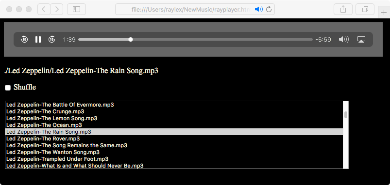

# rayplayer
# Requirment
The rayplayer relies on a linuxi/macos terminal. Windows users need to have WSL or WSL2. Open the termainal and cd to the folder of songs. Run the following to create songs.js 
```
echo const Songs = [ > songs.js
find . -name "*.mp3" -or -name "*.ogg" | sed 's#\(.*\)#"\1",#' >> songs.js
echo ] >> songs.js
```
and download rayplayer.html
```
wget https://raw.githubusercontent.com/raylexlee/rayplayer/main/rayplayer.html
```
# Procedure
Using a modern browswe, open the rayplayer.html inside the folder.
# Screenshots
Microsoft Edge on Windows 11 Home

Safari on Mac OSX Sierra

